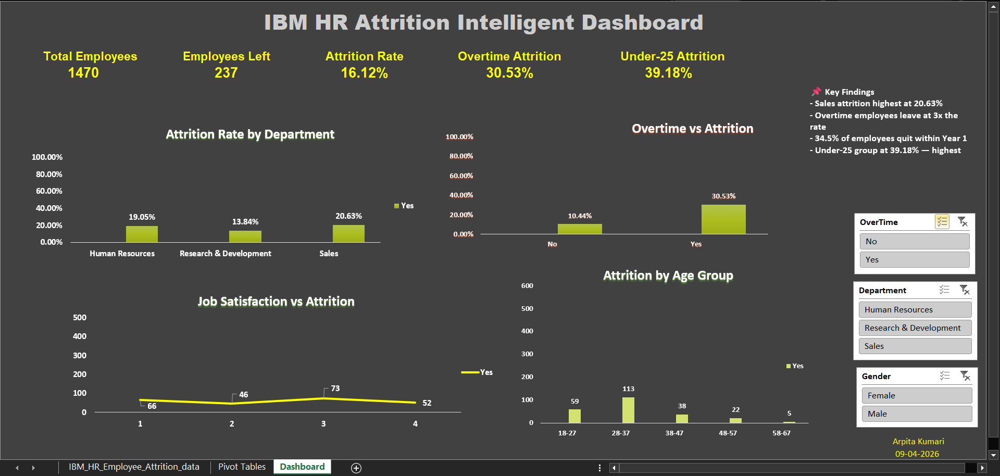

# IBM HR Attrition Intelligence Analysis

## 📌 Project Overview
An end-to-end workforce attrition analysis of IBM's HR dataset comprising 
1,470 employees across 3 departments. The goal was to identify the primary 
drivers of employee attrition and provide actionable recommendations to HR leadership.

**Tools Used:** MySQL • Microsoft Excel (Pivot Tables, Dashboard, Slicers)  
**Dataset:** IBM HR Analytics Employee Attrition — Kaggle (1,470 rows, 35 columns)  
**Author:** Arpita Kumari | [LinkedIn](https://linkedin.com/in/arpita-kumari-82b68b1b2)

---

## 📊 Dashboard Preview

---

## 🔍 Key Findings

| Finding | Value | Benchmark |
|---|---|---|
| Overall Attrition Rate | 16.12% | 10–15% industry avg |
| Sales Department Attrition | 20.63% | Highest dept |
| Overtime Attrition Rate | 30.53% | 3x non-overtime (10.44%) |
| Under-25 Attrition | 39.18% | Highest age group |
| Year 1 Attrition | 34.50% | Danger zone |
| Highest Risk Profile | Sales Rep + Overtime | 66.67% attrition |
| Estimated Annual Cost | $9.2M+ | Replacement cost |

---

## 🛠 SQL Analysis
9 business queries written in MySQL covering:
- Overall attrition rate calculation
- Departmental breakdown
- Overtime impact analysis
- Salary comparison (left vs stayed)
- Age group segmentation using **CTEs**
- Tenure risk ranking using **RANK() window function**
- Job satisfaction correlation
- Multi-factor risk profiling
- Salary hike vs attrition analysis

📄 See full queries: [SQL_Queries.sql](SQL_Queries.sql)

---

## 📈 Excel Dashboard
- 5 KPI cards (Total Employees, Attrition Rate, Overtime Rate, Under-25 Rate)
- 4 Pivot Charts (Department, Overtime, Age Group, Job Satisfaction)
- 3 Connected Slicers (Department, OverTime, Gender)
- Key Findings text box with anchor insights

---

## 📋 Business Insight Report
Full stakeholder report with Executive Summary, Methodology, 
Key Findings, Business Impact, and 5 Recommendations.

📄 See full report: [IBM_HR_Attrition_Report.pdf](IBM_HR_Attrition_Report.pdf)

---

## 💡 Top Recommendations
1. **Implement Overtime Cap Policy** — reduce 30.53% overtime attrition
2. **Redesign Year 1 Onboarding** — address 34.50% first-year exits
3. **Review Sales Rep Compensation** — $2,513/month driving 66.67% attrition
4. **Launch Under-25 Career Program** — retain 39.18% at-risk young talent
5. **Job Satisfaction Early Warning System** — flag score-1 employees proactively

---

## 📁 Repository Structure
*Dataset source: IBM HR Analytics Employee Attrition — available on Kaggle*
